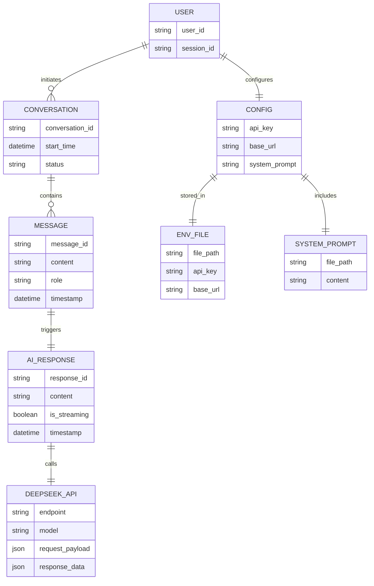
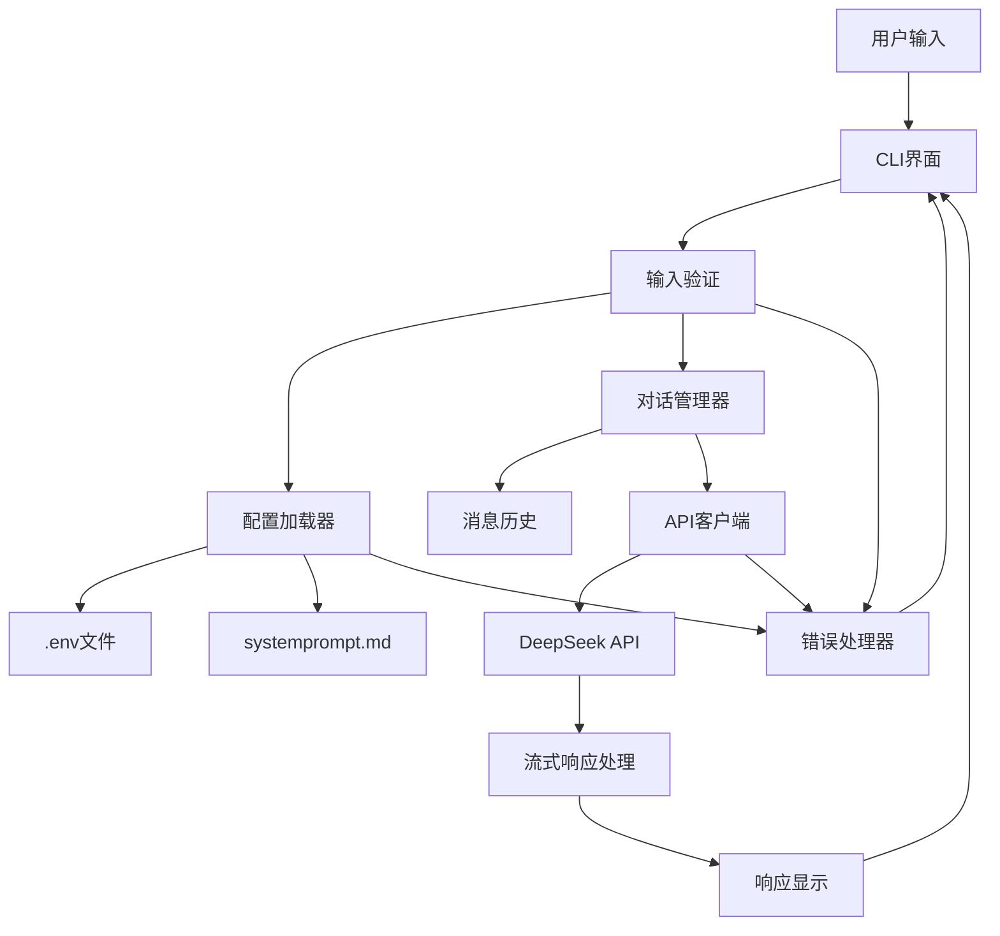
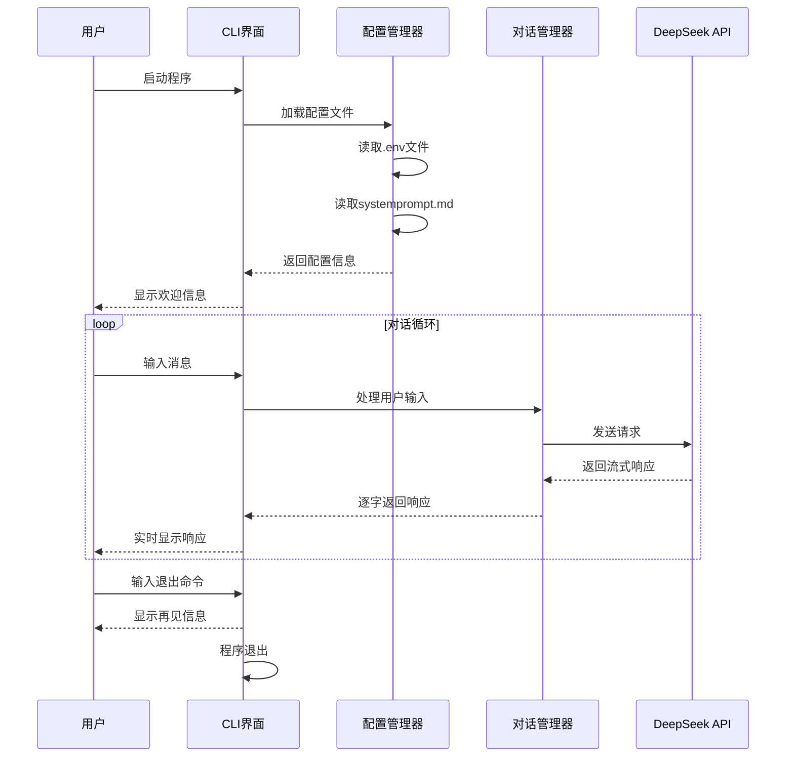
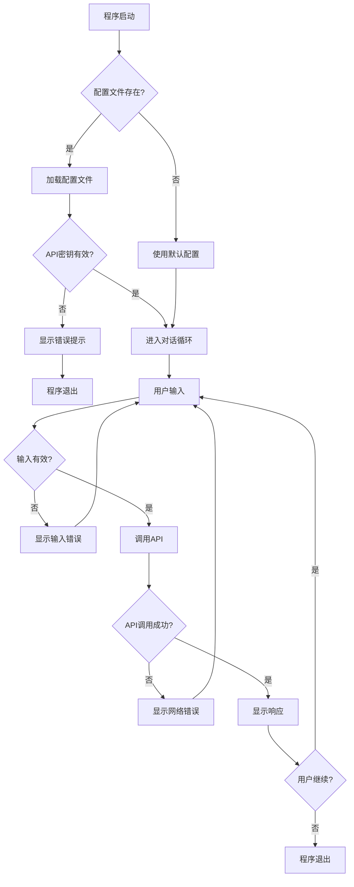
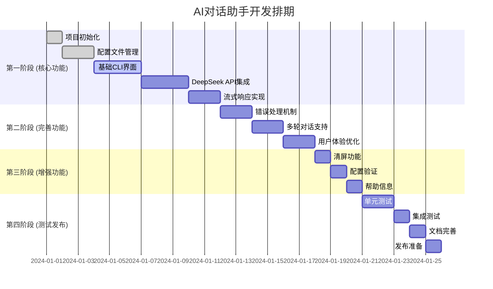
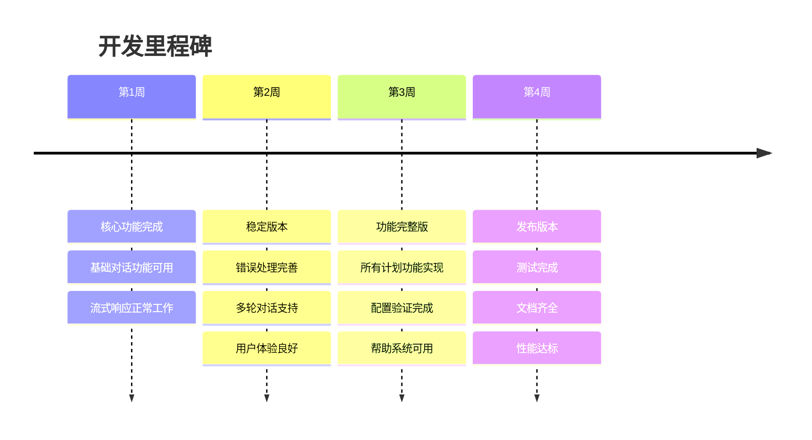

# AI对话助手 - 产品需求文档 (PRD)

## 1. 产品概述

### 1.1 产品名称
AI对话助手 (AI Chat Assistant)

### 1.2 产品定位
一个基于DeepSeek API的命令行界面AI对话助手，支持流式响应，提供简洁高效的AI交互体验。

### 1.3 目标用户
- 开发者和技术人员
- 需要快速AI咨询的用户
- 偏好命令行工具的用户

## 2. 核心功能需求

### 2.1 基础对话功能
- 支持与AI进行文本对话
- 实时流式响应显示
- 保持单次会话的上下文连续性

### 2.2 配置管理
- 通过.env文件管理API密钥
- 通过systemprompt.md文件自定义系统提示词
- 支持配置文件热加载

### 2.3 CLI交互界面
- 简洁的命令行界面
- 清晰的输入提示
- 优雅的响应展示

## 3. 用户故事

### 3.1 核心用户故事

**故事1：启动对话**
- **WHO**: 作为一个开发者
- **GIVEN**: 当我需要快速咨询AI问题时
- **WHAT**: 我希望能够通过命令行启动AI对话助手
- **WHEN**: 在任何需要AI帮助的时候
- **WHY**: 以便快速获得AI的帮助和建议

**故事2：流式对话体验**
- **WHO**: 作为一个用户
- **GIVEN**: 当我向AI提问时
- **WHAT**: 我希望能够看到AI的回答实时逐字显示
- **WHEN**: 在AI生成回答的过程中
- **WHY**: 以便获得更好的交互体验，不用等待完整回答

**故事3：配置API密钥**
- **WHO**: 作为一个新用户
- **GIVEN**: 当我第一次使用这个工具时
- **WHAT**: 我希望能够简单地配置我的DeepSeek API密钥
- **WHEN**: 在首次运行程序之前
- **WHY**: 以便程序能够正常调用AI服务

**故事4：自定义系统提示词**
- **WHO**: 作为一个高级用户
- **GIVEN**: 当我需要AI扮演特定角色或遵循特定规则时
- **WHAT**: 我希望能够修改系统提示词
- **WHEN**: 在需要定制AI行为的时候
- **WHY**: 以便获得更符合我需求的AI回答

**故事5：错误处理**
- **WHO**: 作为一个用户
- **GIVEN**: 当网络连接失败或API调用出错时
- **WHAT**: 我希望能够看到清晰的错误提示
- **WHEN**: 在程序运行出现问题时
- **WHY**: 以便我能够快速定位和解决问题

### 3.2 辅助用户故事

**故事6：退出程序**
- **WHO**: 作为一个用户
- **GIVEN**: 当我完成对话需要退出时
- **WHAT**: 我希望能够通过简单的命令退出程序
- **WHEN**: 在对话结束时
- **WHY**: 以便优雅地结束会话

**故事7：清屏功能**
- **WHO**: 作为一个用户
- **GIVEN**: 当对话内容过多影响阅读时
- **WHAT**: 我希望能够清空屏幕内容
- **WHEN**: 在需要清理界面时
- **WHY**: 以便保持界面整洁

## 4. 技术需求

### 4.1 开发环境
- Python 3.8+（使用最新稳定版本）
- 最小化外部依赖
- 单一Python文件实现

### 4.2 API集成
- 使用OpenAI API调用格式
- 集成DeepSeek API
- 支持流式响应

### 4.3 配置文件
- `.env`文件存储敏感配置
- `systemprompt.md`文件存储系统提示词
- 支持配置文件不存在时的默认处理

### 4.4 错误处理
- 网络连接错误处理
- API调用失败处理
- 配置文件缺失处理
- 用户输入验证

## 5. 非功能性需求

### 5.1 性能要求
- 响应延迟 < 2秒（网络正常情况下）
- 流式响应实时显示
- 内存占用 < 50MB

### 5.2 可用性要求
- 简单直观的命令行界面
- 清晰的错误提示信息
- 支持中文和英文交互

### 5.3 可维护性要求
- 代码结构清晰
- 注释完整
- 易于扩展和修改

## 6. 验收标准

### 6.1 基本功能验收
- [ ] 能够成功启动程序
- [ ] 能够读取.env文件中的API密钥
- [ ] 能够读取systemprompt.md中的系统提示词
- [ ] 能够与DeepSeek API成功通信
- [ ] 能够显示流式响应
- [ ] 能够处理多轮对话

### 6.2 错误处理验收
- [ ] API密钥错误时显示清晰提示
- [ ] 网络连接失败时显示错误信息
- [ ] 配置文件缺失时使用默认值
- [ ] 用户输入为空时的处理

### 6.3 用户体验验收
- [ ] 界面简洁美观
- [ ] 响应速度满足要求
- [ ] 错误提示信息清晰
- [ ] 支持优雅退出

## 7. 项目文件结构

```
ai-chat-assistant/
├── chat.py              # 主程序文件
├── .env                 # API密钥配置
├── systemprompt.md      # 系统提示词
├── requirements.txt     # 依赖列表
└── README.md           # 使用说明
```

## 8. 开发优先级

### P0 (必须实现)
- 基础CLI对话功能
- DeepSeek API集成
- 流式响应显示
- 配置文件读取

### P1 (重要功能)
- 错误处理机制
- 多轮对话支持
- 优雅退出功能

### P2 (增强功能)
- 清屏功能
- 配置验证
- 使用帮助信息

## 9. 风险评估

### 9.1 技术风险
- DeepSeek API稳定性
- 网络连接问题
- Python版本兼容性

### 9.2 缓解措施
- 实现重试机制
- 添加超时处理
- 明确Python版本要求

## 10. 系统设计图

### 10.1 实体关系图



### 10.2 系统架构图



### 10.3 用户交互时序图



### 10.4 错误处理流程图



## 11. 需求优先级排期

### 11.1 开发阶段划分



### 11.2 详细需求优先级

#### P0 - 核心功能 (第1周)
| 需求 | 优先级 | 预估工时 | 依赖关系 | 验收标准 |
|------|--------|----------|----------|----------|
| 项目结构搭建 | P0 | 0.5天 | 无 | 文件结构创建完成 |
| 配置文件读取 | P0 | 1天 | 项目结构 | 能读取.env和.md文件 |
| 基础CLI界面 | P0 | 1.5天 | 配置文件 | 能显示提示符和接收输入 |
| DeepSeek API集成 | P0 | 1.5天 | CLI界面 | 能成功调用API |
| 流式响应显示 | P0 | 1天 | API集成 | 能实时显示响应内容 |

#### P1 - 重要功能 (第2周)
| 需求 | 优先级 | 预估工时 | 依赖关系 | 验收标准 |
|------|--------|----------|----------|----------|
| 基础错误处理 | P1 | 1天 | 流式响应 | 网络错误能正确处理 |
| 多轮对话支持 | P1 | 1天 | 错误处理 | 能保持上下文连续性 |
| 优雅退出功能 | P1 | 0.5天 | 多轮对话 | 支持quit/exit命令 |
| 用户体验优化 | P1 | 1.5天 | 退出功能 | 界面美观，提示清晰 |

#### P2 - 增强功能 (第3周)
| 需求 | 优先级 | 预估工时 | 依赖关系 | 验收标准 |
|------|--------|----------|----------|----------|
| 清屏功能 | P2 | 0.5天 | 用户体验 | 支持clear命令 |
| 配置文件验证 | P2 | 0.5天 | 清屏功能 | 能验证配置有效性 |
| 帮助信息显示 | P2 | 0.5天 | 配置验证 | 支持help命令 |
| 高级错误处理 | P2 | 1天 | 帮助信息 | 完善的错误恢复机制 |

#### P3 - 测试发布 (第4周)
| 需求 | 优先级 | 预估工时 | 依赖关系 | 验收标准 |
|------|--------|----------|----------|----------|
| 单元测试编写 | P3 | 1天 | 高级错误处理 | 测试覆盖率>80% |
| 集成测试 | P3 | 0.5天 | 单元测试 | 端到端功能正常 |
| 文档完善 | P3 | 0.5天 | 集成测试 | README和注释完整 |
| 性能优化 | P3 | 1天 | 文档完善 | 满足性能要求 |

### 11.3 里程碑节点



### 11.4 风险评估与应对

| 风险项 | 影响程度 | 发生概率 | 应对措施 | 负责人 |
|--------|----------|----------|----------|--------|
| DeepSeek API变更 | 高 | 中 | 实现适配层，监控API文档 | 开发者 |
| 网络连接不稳定 | 中 | 高 | 增加重试机制和超时处理 | 开发者 |
| Python版本兼容性 | 低 | 低 | 明确最低版本要求 | 开发者 |
| 用户体验不佳 | 中 | 中 | 早期用户测试和反馈收集 | 开发者 |

## 12. 交付物

- 完整的Python程序文件
- 配置文件模板
- 使用说明文档
- 依赖列表文件
- 系统设计文档
- 测试用例文档